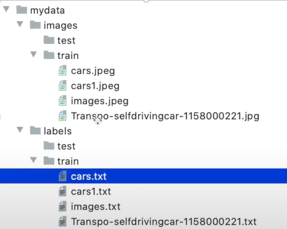

# 训练自己的模型

1. 收集数据集
    - 手动收集
    - 自动收集

2. 创建训练集结构框架

    - mydata

        - image

            - train
            - test
        - label

            - train
            - test

        madata.yaml



## 关于madata.yaml代码结构  

``` yaml
path: D:\YOLO\Project\yolo_A    #训练集的根目录
train: images\train             #训练集
val: images\val                 #测试集

# number of classes

# 类别数量，因为这个数据集只有一个类别
nc: 1

# 类别名字
names: ['face']
#txt文件中注意文件数字的顺序
```
